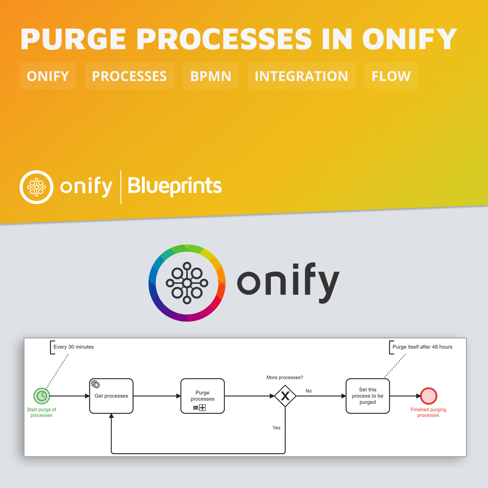

# Onify Blueprint: Purge processes in Onify

This blueprint show how we easy can purge processes in Onify based on process tags (`tag:purge`). It is scheduled to run every 30 minutes. See below for information how to set it up.

## Requirements

* [Onify Hub](https://github.com/onify/install) (API version 2.14.1 or higher)
* [Camunda Modeler](https://camunda.com/download/modeler/)

## Setup

To start purging processes you first need to start tagging the process. This can either be done via the workflow where the tags will be inherited to the process once you start a process. Or you can in a process set the tags.

Each process that should be purged needs the following tags:

* `purge` - This is required to be part of the purge process
* `purge:{hours}:{status}:{type}` - This is the part where you specify when and how a process should be purged. `status` is a list of statuses that is separated with a comma.

> Note: The hours is calculated by the enddate. This means that processes missing enddate will not be purged.

Purge types:

* `full` (default) - Delete the process permanently
* `data` - Only purge process data (Remove `flowstate` and `bpmn` data (useful for saving disk space))

### Examples 

* `purge:24:Completed` - Full purge process after 24 hours if the status is Completed
* `purge:1:Completed,Stopped` - Full purge process after 1 hour if the status is Completed or Stopped
* `purge:168:Stopped` - Full purge process after 1 week if the status is Stopped
* `purge:2190:Completed,Stopped:full` - Full purge process after 3 months if the status is Completed or Stopped
* `purge:48:Completed,Stopped:data` - Partial purge process after 48 hours if the status is Completed or Stopped

## Deploy

1. Open the BPMN diagram in Camunda Modeler.
2. Deploy the BPMN diagram (click `Deploy current diagram` and follow the steps).

> NOTE: You can check the process output for some stats...

## Support

* Community/forum: https://support.onify.co/discuss
* Documentation: https://support.onify.co/docs
* Support and SLA: https://support.onify.co/docs/get-support

## License

This project is licensed under the MIT License - see the [LICENSE](LICENSE) file for details.